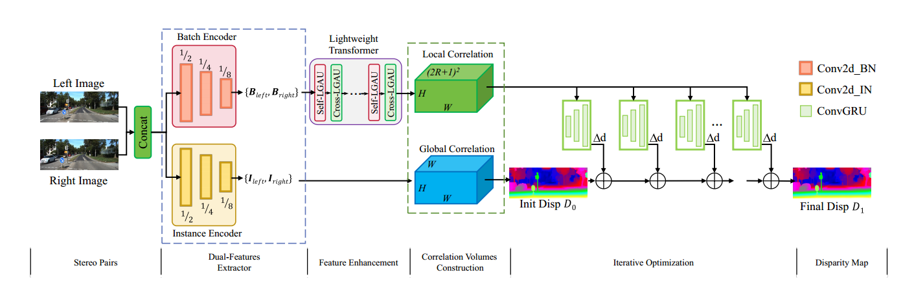
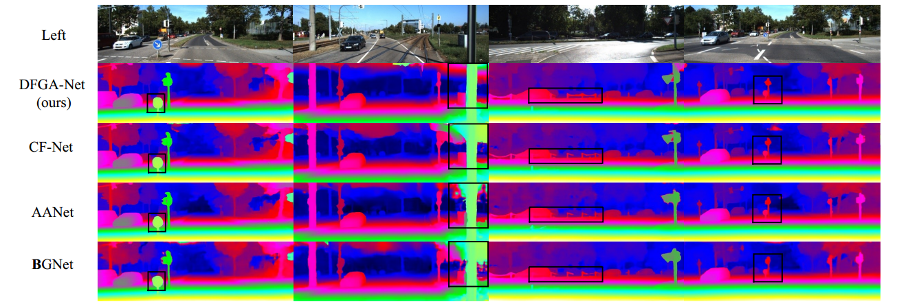

## DFGA-Net
DFGA-Net: Achieving Efficient and High-Accuracy Stereo Matching through Dual-Feature Extraction and Lightweight Gated Attention

## Introduction

DFGA-Net proposes an efficient and accurate stereo matching approach through a novel Dual-Features Gated Attention Network. It employs a Dual-Features Extractor that integrates Instance Normalization and Batch Normalization to capture both personalized and generalized sample features, addressing environmental variability. Furthermore, DFGA-Net utilizes a Lightweight Transformer architecture with Lightweight Gated Attention Units to efficiently capture long-range dependencies, enhancing feature richness. Experimental results reveal that DFGA-Net attains exceptional efficiency and performance across a variety of datasets, including SceneFlow, KITTI 2012, KITTI 2015, and ETH3D, outperforming accuracy-centric models.


## Performance


## Environment
* Ubuntu 16.04 with Nvidia RTX 3090 GPU
* python==3.11.4
* Pytorch == 2.0.1
* Other requirements: `pip install -r requirements.txt`

## Datasets
Download [Scene Flow Datasets](https://lmb.informatik.uni-freiburg.de/resources/datasets/SceneFlowDatasets.en.html), [KITTI 2012](http://www.cvlibs.net/datasets/kitti/eval_stereo_flow.php?benchmark=stereo), [KITTI 2015](http://www.cvlibs.net/datasets/kitti/eval_scene_flow.php?benchmark=stereo), [ETH3D](https://www.eth3d.net/)

## License
Please note that all codes are protected by patents. They can only be used for research purposes. 

## Acknowledgements
Part of the code is adopted from some previous work: [GMStereo](https://github.com/autonomousvision/unimatch). We thank the original authors for their awesome repos. 

## Citation
If you find this project helpful in your research, welcome to cite the paper. 
```
@article{Wang2024DFGANet,
  title = {DFGA-Net: efficient stereo matching with high accuracy via dual-features and gated attention},
  author = {Guohui Wang, Yuanwei Bi, Lujian Zhang, Dawei Wang},
  year = {2024},
  note = {to be published.} 
  }
```
